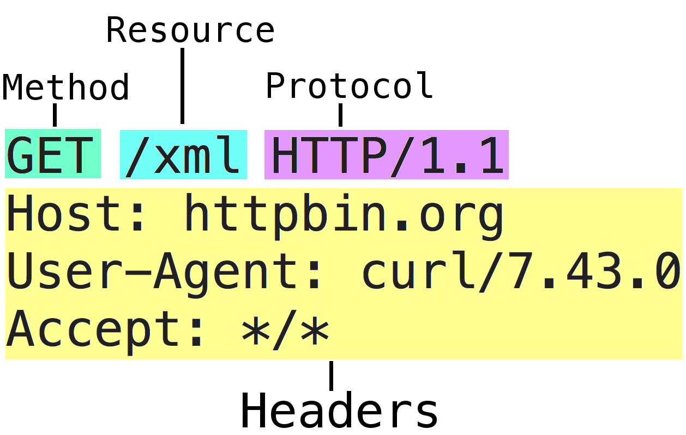

## Web - Basics

Learn the basics of building web services and applications in Go.

## Notes

* The standard library has much of what you need to build services and apps.
* The http package provides the building blocks.

## Links

https://golang.org/pkg/net/http/  
https://golang.org/doc/articles/wiki/  

## Code Review

[Simple Web Service](example1/main.go)  
[Using a New Server Mux](example2/main.go)  
[User Defined Handler I](example3/main.go)  
[User Defined Handler II](example4/main.go)  
[Concurrency](example5/main.go)  

## Notes

An HTTP Request

The Response

## Exercises

### Exercise 1

Write a simple web service that has a set of different routes that return the string "Hello World" in multiple languages. Build the service using an Application context that will own the different handler methods. Then create your own mux, bind the routes and start the service. Validate your routes work in your browser.
___
All material is licensed under the [Apache License Version 2.0, January 2004](http://www.apache.org/licenses/LICENSE-2.0).
